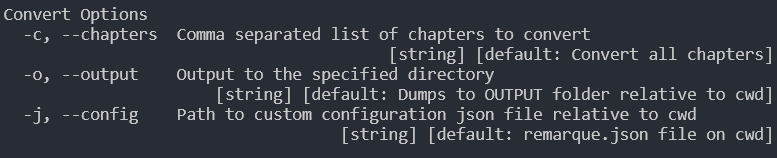

# Remarque

A package to convert your markdown to a full blown web app

## Steps

1. Clone or download the `experiment` branch. It always has the latest commits
2. Go into the remarque directory by using `cd Remarque`.
3. Make sure you have node.js installed on your machine
4. Install all the dependencies by running `npm i`
5. After that just run `npm i -g`, to install remarque globally
6. Follow the <a href="./Guidelines.md">Guidelines</a> and for a overview of the commands check below.

## Package

WIP

## CLI

### Commands


#### `convert`

Alias `cnv`

##### Options



* `c`, `chapters`: Comma separated list of chapters to convert
* `o`, `output` : Directory where to dump all the converted files

##### Examples


```shell
remarque convert -c               Converts all the chapters
remarque convert -c 1             Convert the chapter 1
remarque convert -c 1-5           Convert chapters 1-5
remarque convert -c 1-5,6         Convert chapters 1-5 and chapter 6
remarque convert -c 1-5,6-8       Convert chapters 1-5 and chapters 6-8
remarque convert -c 1 -o OUTPUTS  dumps chapter 1 to OUTPUTS directory
remarque convert -c -o OUTPUTS    dumps all the converted files to OUTPUTS
                                  directory
remarque convert -c -o            dumps all the converted files to OUTPUT
                                  directory
```

#### `stat`

WIP
